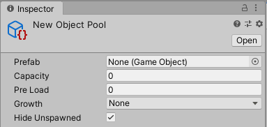

# Replicator 🌌

Whooshy GameObject pooling / reuse for Unity.

I've been working on this system on and off for a little while. I decided it should finally see the light of day 🌄.

✨ __Features:__

- Object pooling
- Pools are assets in your project, making them easy to configure
- Easy to replace existing code

🚧 __Replicator is still under construction.__ *There is __no stable version__ yet* 🚧

__Current Version:__ [0.1-alpha](../../releases/tag/v0.1.1-alpha)

## Getting Started

Replicator makes it simple to rework existing code to use object pooling. Set up a pool, swap `Instantiate` calls to `Spawn` and `Destroy` calls to `Recycle`.

First, create an Object Pool in your project.


Configure the pool (refer to the [Manual](../../wiki/Manual) for guidance on pool configuration).



Your object pool is set up and ready to use! Making sure your script has a `using Replicator;` directive, the basics are:

```csharp
    public ObjectPool pool;

    void Update() {
        GameObject clone = pool.Spawn(Vector3.zero, Quaternion.identity);
        // ... Some time later:
        clone.Recycle();
    }
}
```

With a flexible API, there are several ways to `Spawn()` / `Recycle()` GameObjects in whichever way makes sense for your project. As long as a prefab is assigned to a pool, you can use the GameObject reference for `Spawn()`-ing & `Recycle()`-ing too:

```csharp
public GameObject pooledPrefab;

void Update() {
    GameObject clone = pooledPrefab.Spawn();
    // ... Some time later:
    clone.Recycle();
}
```

On top of that, extensions to MonoBehaviour allow your scripts to directly call `Spawn()` or `Recycle()` in much the same manner as `Instantiate()` and `Destroy()`:

```csharp
void Update() {
    GameObject clone = Spawn(pooledPrefab, Vector3.zero, Quaternion.identity);
    // ... Some time later:
    Recycle(clone);
}
```

Replicator also includes the interfaces `ISpawned`, `IRecycled` and `IPooled` for allowing scripts to hook into the Spawn/Recycle lifecycle.

Full details can be found at the [API Wiki](../../wiki/API).

### Good to Know

Some Unity components, such as `Rigidbody`, require some special handling to ensure that behaviour following recycling / re-spawning is as expected. As an example, a `Rigidbody` does not reset its `velocity` or `angularVelocity` when deactivated. Replicator includes scripts, found in the Component menu under Pooling, for cleaning up the following commonly-used Components:

- `Rigidbody`
- `Rigidbody2D`

## Installing

Head over to [Releases](../../releases) to download a unitypackage the most recent version appropriate for your Unity version. Import the package into your Unity project.

If you'd rather work on Replicator itself, it's much easier to just clone the repository, which is a complete Unity project.

## Contributing

Found a bug 🐛?
Have some feedback 💭?
Want to add a feature to the wishlist ✨?

Here are some ways you can help make Replicator better:

- Open an [Issue](../../issues) 🐛💭✨
- Contact [@ettmetal] on Twitter 💭✨
- Send a [PR](../../pulls) 🐛✨

[@ettmetal]: https://twitter.com/ettmetal

## License

Copyright © 2019 [Joe Osborne](https://gihub.com/ettmetal/).

Replicator is released under the MIT license. Refer to [LICENSE.md](LICENSE.md) in this repository for more information.
